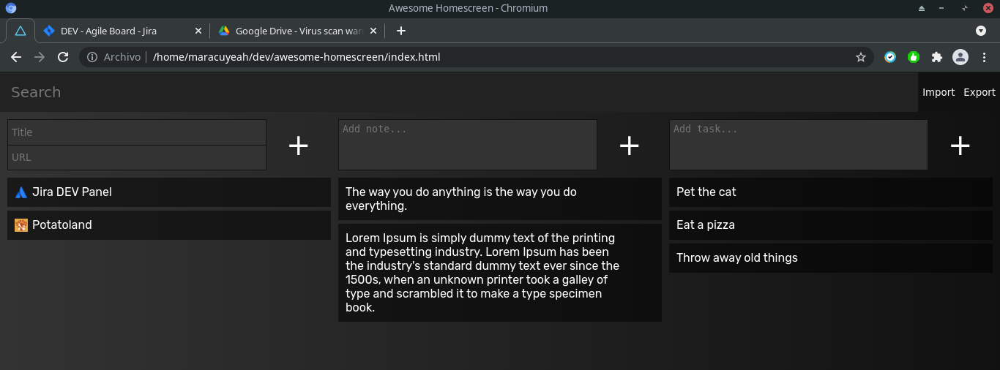

# awesome-homescreen

A homescreen with Bookmarks, Todo and Notes. Made with Vanilla JS, CSS and HTML.

Just download and open it. All data is stored into localStorage. You can use the export/import options to keep a copy of your stuff and/or move it somewhere else.